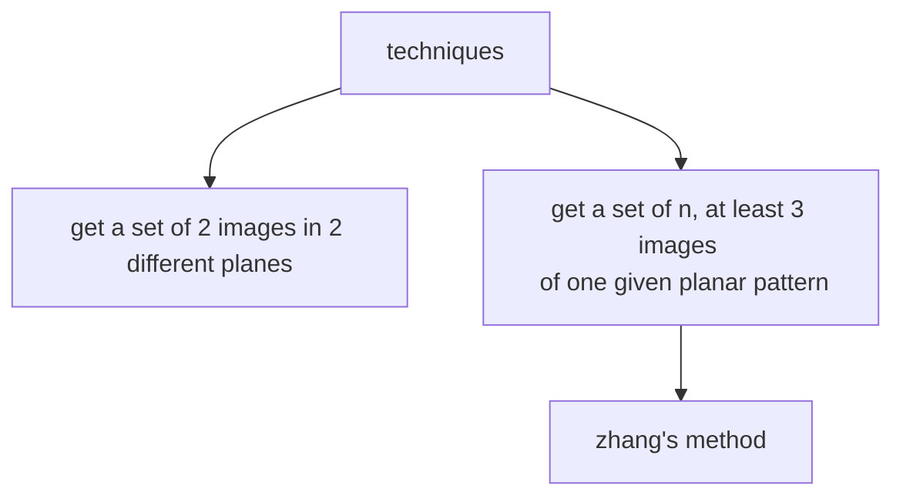

# CAMERA CALIBRATION

It's necessary to recover the [PPM](PERSPECTIVE_PROJECTION_MATRIX.md) parameters from the system in order to use the camera model, this process is called camera calibration.

The basic idea behind this process is to **set up a linear system of equation given a set of 3D-2D correspondences** such that the solution is the unknown camera parameters

In order to obtain such correspondences a set of geometrical targets such as chess boards or dot pattern are used

There are 2 principle approaches:

One of the most used methods it's the [zhang's method](ZHANG_METHOD.md)

[PREVIOUS](pages/image_formation_acquisition/HOMOGRAPHY.md) [NEXT](pages/image_formation_acquisition/ZHANG_METHOD.md)
