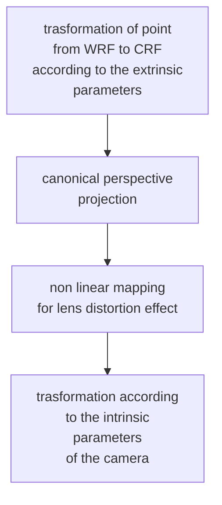

# IMAGE FORMATION FLOW

```mermaid
flowchart TD
A["`trasformation of point 
from WRF to CRF 
according to the extrinsic
parameters`"]
B["`canonical perspective 
projection`"]
C["`non linear mapping 
for lens distortion effect `"]
D["`trasformation according 
to the intrinsic 
parameters 
of the camera`"]
A --> B
B --> C
C --> D
```
