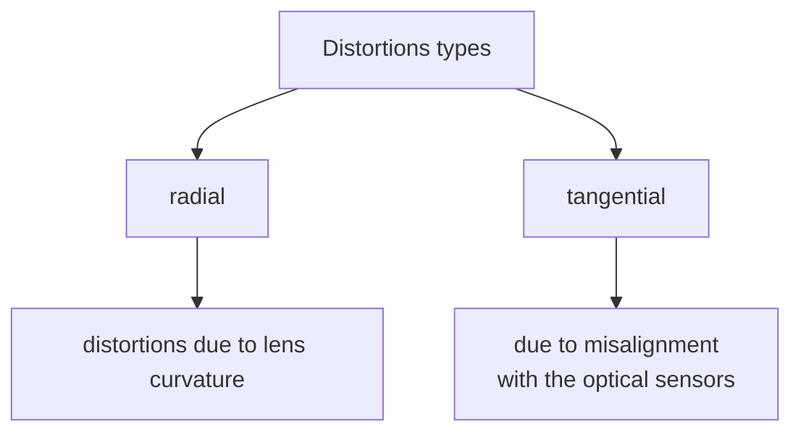

# LENS DISTORTION

In real case scenarios there is the need to model the effect of lens distortion on the image

there are 2 principle types of distortion:

In order to account this types of distortion the model is adjusted accordingly:

$$
\begin{bmatrix}
x_{'}\\
y_{'}\\
\end{bmatrix}= L(r) \times
\begin{bmatrix}
\overset{\sim}x \\
\overset{\sim}y \\
\end{bmatrix} +
\begin{bmatrix}
d\overset{\sim}x \\
d\overset{\sim}y \\
\end{bmatrix}
$$
Where the non-distorted coordinates ($\begin{bmatrix}\overset{\sim}x \\ \overset{\sim}y \\ \end{bmatrix}$) are mapped to distorted coordinates ($\begin{bmatrix}x_{'} \\ y_{'} \\ \end{bmatrix}$) through a non linear function $L(r)$ of the distance from the distortion center $r= \sqrt{(\overset{\sim}x - \overset{\sim}x_{c})^2+(\overset{\sim}x - \overset{\sim}x_{c})^2}$

The $L(r)$ function is defined for positive values of $r$ only and for $r =0 \space L(r) =1$. This non linear function is approximated by it's Taylor series:

$$
L(r) = 1 + k_{1}r^2+ k_{2}r^4+ k_{3}r^6 ....
$$

The tangential distortion is approximated as follows

$$
\begin{bmatrix}
d\overset{\sim}x \\
d\overset{\sim}y \\
\end{bmatrix} =
\begin{bmatrix}
2p_{1}\overset{\sim}x\overset{\sim}y + p_{2} (r^2 + 2\overset{\sim}x^2) \\
 p_{1} (r^2 + 2\overset{\sim}x^2) +2p_{2}\overset{\sim}x\overset{\sim}y \\
\end{bmatrix}
$$

The radial coefficients $k_{1} k_{2}....$  the optical center $(x_c,y_c)$ and the tangential distortion coefficients $p_1,p_2$ are the set of lens distortion parameters that need to be accounted for a realistic modeling of the camera. (for the sake of simplicity the distortion center is taken to coincide with the optical center)

[PREVIOUS](pages/image_formation_acquisition/LENS.md) [NEXT](pages/image_formation_acquisition/STEREO_IMAGE_ACQUISITION.md)
