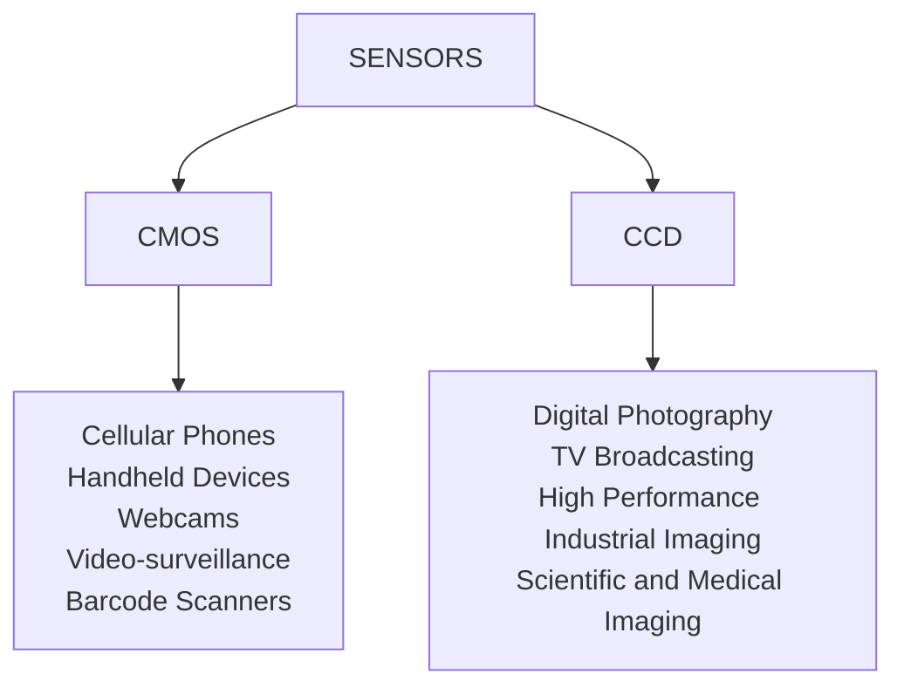

# SENSORS

there are 2 main technologies for camera sensors, **CCD** and **CMOS**

In short **CMOS** is for low quality mass production and **CCD** is for high end quality image processing.

[PREVIOUS](pages/image_formation_acquisition/IMAGE_DIGITIZATION.md) [NEXT](pages/image_formation_acquisition/LENS.md)
