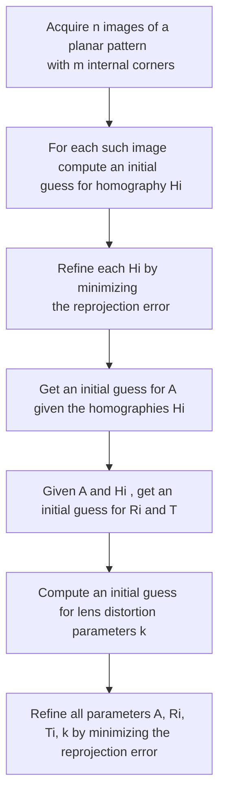

# ZHANG'S METHOD

The zhang's method relies in getting a series of n images of a chessboard patterns where are known

- $n,m$ number of internal corners of the pattern, different in the 2 directions
- $k$ size of squares of the pattern

### ESTIMATING H

this is done exploiting the facts that the calibration pattern is planar so the mapping between 3D and 2D coordinates is a [HOMOGRAPHY](HOMOGRAPHY.md)

only 2 of the previous equation are linear independent

now we can use singolar value decomposition to estimate homography H

### NON LINEAR REFINEMENT

with the previous estimation of H we can minimize the reprojection error with the Levenberg-Marquardt (LM) algorithm

### ESTIMATING INTRINSIC PARAMETERS

we can say that the previous homography and the PPM are related as follows

because R is orthonormal we can  say that:

so if `B=A^-T*A^-1` we can say that

therefore any calibration image provides 2 linear independent equations so we can estimate the A matrix with minimum 3 images

### ESTIMATING EXTRINSIC PARAMETERS

with H and A we can estimate the R and T matrix as follow

and then r3 can be derived form r1 and r2 exploiting orthonormality

