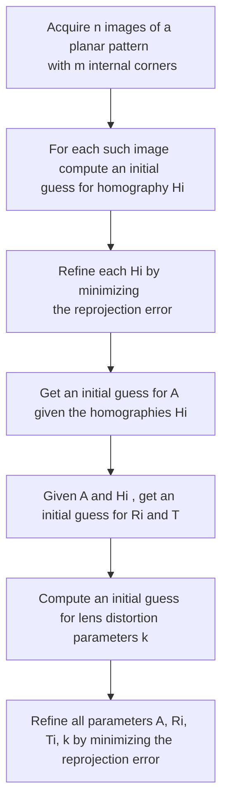

# ZHANG'S METHOD

The zhang's method relies in getting a series of n images of a chessboard patterns where are known

- $n,m$ number of internal corners of the pattern, different in the 2 directions
- $k$ size of squares of the pattern

from this images the goal is to extract the $PPM$ matrix parameters:

## SETTING A WRF

so given a set of images the WRF is taken with origin at the top-left corner of the patter(that could easily be detected)

Given this setup with the **WRF** parallel to the $Z$ axis we can consider the control point to have $z=0$ so the relation with the image points **became a [HOMOGRAPHY](HOMOGRAPHY.md)**

## DISCOVERING $H$

so given a pattern with $m$ corners it's possible to write $m$ sets of 3 linear equations where 2D and 3D coordinates are known so we can compute the $H$ matrix

$$
k\overset{\sim}m = H\overset{\sim}w_{'}\Rightarrow \overset{\sim}m\times H\overset{\sim}w_{'}\Rightarrow
\begin{bmatrix}
vh_{3}^T\overset{\sim}w_{'}- h_{2}^{T}\overset{\sim}w_{'}\\
h_{1}^T\overset{\sim}w_{'}- uh_{3}^{T}\overset{\sim}w_{'}\\
uh_{2}^T\overset{\sim}w_{'}- vh_{1}^{T}\overset{\sim}w_{'} 
\end{bmatrix}=0
$$

So extracting the $h$ vector from the system:

$$
\begin{bmatrix}
0^T & -\overset{\sim}w^{'T} & v\overset{\sim}w^{'T}\\
 \overset{\sim}w^{'T} &0^T & -u\overset{\sim}w^{'T}\\
 -v\overset{\sim}w^{'T}  & u\overset{\sim}w^{'T}&0^T \\
\end{bmatrix}\times
\begin{bmatrix}
h_{1}\\
h_{2}\\
h_{3}\\
\end{bmatrix}=Ah=0
$$

From this system in 3 equations in 9 unknowns only 2 equation are linear independent, the 3 equation is discarded.
For each image a similar system of equations is built in order to minimize the algebraic error due to the norm of $Ah$

--------------------------------

### ESTIMATING H
now we can use singolar value decomposition to estimate homography H

### NON LINEAR REFINEMENT

with the previous estimation of H we can minimize the reprojection error with the Levenberg-Marquardt (LM) algorithm

### ESTIMATING INTRINSIC PARAMETERS

we can say that the previous homography and the PPM are related as follows

because R is orthonormal we can  say that:

so if `B=A^-T*A^-1` we can say that

therefore any calibration image provides 2 linear independent equations so we can estimate the A matrix with minimum 3 images

### ESTIMATING EXTRINSIC PARAMETERS

with H and A we can estimate the R and T matrix as follow

and then r3 can be derived form r1 and r2 exploiting orthonormality

