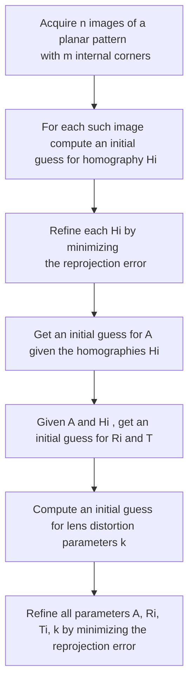

# ZHANG'S METHOD

The zhang's method relies in getting a series of n images of a chessboard patterns where are known

- $n,m$ number of internal corners of the pattern, different in the 2 directions
- $k$ size of squares of the pattern

from this images the goal is to extract the $PPM$ matrix parameters:

## GETTING CORNERS IMAGE COORDINATES

Corners can be detected easily from the image by using the [Harris detector](HARRIS_CORNER_DETECTOR.md)

## SETTING A WRF

so given a set of images the WRF is taken with origin at the top-left corner of the patter(that could easily be detected)

Given this setup with the **WRF** parallel to the $Z$ axis we can consider the control point to have $z=0$ so the relation with the image points **became a [HOMOGRAPHY](HOMOGRAPHY.md)**

## MAKING A GUESS FOR $H$

so given a pattern with $m$ corners it's possible to write $m$ sets of 3 linear equations where 2D and 3D coordinates are known so we can compute the $H$ matrix

$$
k\overset{\sim}m = H\overset{\sim}w_{'}\Rightarrow \overset{\sim}m\times H\overset{\sim}w_{'} = 0 \Rightarrow
\begin{bmatrix}
vh_{3}^T\overset{\sim}w_{'}- h_{2}^{T}\overset{\sim}w_{'}\\
h_{1}^T\overset{\sim}w_{'}- uh_{3}^{T}\overset{\sim}w_{'}\\
uh_{2}^T\overset{\sim}w_{'}- vh_{1}^{T}\overset{\sim}w_{'}
\end{bmatrix}=0
$$

So extracting the $h$ vector from the system:

$$
\begin{bmatrix}
0^T & -\overset{\sim}w^{'T} & v\overset{\sim}w^{'T}\\
 \overset{\sim}w^{'T} &0^T & -u\overset{\sim}w^{'T}\\
 -v\overset{\sim}w^{'T}  & u\overset{\sim}w^{'T}&0^T \\
\end{bmatrix}\times
\begin{bmatrix}
h_{1}\\
h_{2}\\
h_{3}\\
\end{bmatrix}=Ah=0
$$

From this system in 3 equations in 9 unknowns only 2 equation are linear independent, the last one is discarded.
For each image a system of $2m$ equations is built in order to minimize the algebraic error due to the norm of $Ah$ minimizing the problem

$$
Ah:
h^\ast argmin_{h \in R^9}\Vert Ah \Vert
$$

Now the solution to this system can be found with [singular value decomposition (SVD)](https://en.wikipedia.org/wiki/Singular_value_decomposition) of matrix $A$

$$
A = UDV^T
$$

## REFINING $H$

In order to minimize the reprojection error $H$ is chosen by the following non linear minimization problem:

$$
H = argmin_{H\in R^9}(\sum_{j=1}^{m}\Vert \overset{\sim}m_{j}-H\overset{\sim}w_{j}^{'} \Vert^2)
$$

The way the reprojection error is minimized is by comparing the output of the $H$ matrix with the actual image coordinates and minimizing the squared error, the error minimized is also called the **geometric error** this can be done by the [Levenberg-Marquardt algorithm](https://it.wikipedia.org/wiki/Algoritmo_di_Levenberg-Marquardt)

## MAKING A GUESS FOR $A$

With the previous $H$ knowledge it can be said that between $H$ and the $PPM$ exists the following relation

$$
H = [h_{1},h_{2},h_{3}] = [p_{1},p_{2},p_{4}] = \lambda A[r_{1},r_{2},T]
$$

Given that $R$ is an [orthogonal matrix](ORTHOGONAL_MATRIX.md) the following relations are true

$$
r_{1}^Tr_{2} = 0 \Rightarrow h_{1}^TA^{-T}A^{-1}h_{2} = 0
$$
$$
r_{1}^Tr_{1} =r_{2}^Tr_{2}   \Rightarrow h_{1}^TA^{-T}A^{-1}h_{1} = h_{2}^TA^{-T}A^{-1}h_{2}
$$

In this equation the unknowns are $B=A^{-T}A^{-1}$  given the fact that $A$ is upper-triangular  $B$ turns out to be symmetric so the unknowns are just $6$

So given the following definitions

$$
B = A^TA^{-1} =
\begin{bmatrix}
B_{11} &B_{12} &B_{13} \\
B_{12} &B_{22} &B_{23}\\
B_{13} &B_{23} &B_{33} \\
\end{bmatrix} , b = [B_{11}, B_{12}, B_{22}, B_{13}, B_{23}, B_{33} ]^{T}
$$
$$
h_i^T = [h_{i1},h_{i2},h_{i3},]
$$
$$
v_{ij}^T = [h_{i1}h_{j1},h_{i1}h_{j2} + h_{i2}h_{j1},h_{i2}h_{j2},h_{i3}h_{j1} + h_{i1}h_{j3},h_{i3}h_{j2} + h_{i2}h_{j2},h_{i3}h_{j3}]
$$

So the following relation is true

$$
h_{i}^TBh_j = v_{ij}^Tb \Rightarrow
\begin{cases}
h_i^TBh_2 = 0 \Rightarrow v_{12}b^T = 0 \\
h_1^TBh_1 =h_2^TBh_2 \Rightarrow v_{11}^Tb =v_{22}^Tb \Rightarrow (v_{11} - v_{22} )^Tb = 0
\end{cases}
$$

So each image gives 2 independent equations in 6 unknowns for the system $Vb = 0$ which can be solved by the [SVD](https://en.wikipedia.org/wiki/Singular_value_decomposition)

## MAKING A GUESS FOR $R$ AND $T$

Now that $A$ can be guessed the extrinsic parameter of the $PPM$ can be computed so given the previous equation

$$
h_1 = \lambda A r_1 \Rightarrow r_1 = \frac{1}{\lambda}A^{-1}h_1
$$

so because $r_1$ is a unit vector:

$$
\lambda =\Vert h_1 A^{-1}\Vert
$$

$r_2$ can be computed in the same way:

$$
h_2 = \lambda A r_2 \Rightarrow r_2 = \frac{1}{\lambda}A^{-1}h_2
$$

$r_3$ can be derived by exploiting orthogonality $r_3 = r_1 \times r_2$

Finally $T$ can be computed from the $3^{rd}$ vector

$$
h_3 = \lambda A T \Rightarrow T = \frac{1}{\lambda}A^{-1}h_3
$$

## MAKING A  GUESS FOR THE DISTORTION PARAMETERS $K$

At this point the un-distorted coordinates can be calculated from the $H$ matrix and the distorted coordinates can be recovered by the image, so given the lens distortion model:

$$
\begin{bmatrix}
x_{'}\\
y_{'}\\
\end{bmatrix}= L(r) \times
\begin{bmatrix}
\overset{\sim}x \\
\overset{\sim}y \\
\end{bmatrix} +
\begin{bmatrix}
d\overset{\sim}x \\
d\overset{\sim}y \\
\end{bmatrix}
$$

And a Taylor approximation of the non linear function:

$$
L(r) = 1 + k_{1}r^2+ k_{2}r^4
$$

And the relation between distorted and ideal coordinates

$$
\begin{bmatrix}u^{'}\\ v^{'}\\ 1\end{bmatrix}=
A\begin{bmatrix}x^{'}\\ y^{'}\\ 1\end{bmatrix}=
\begin{bmatrix}
a_u & 0 & u_0 \\
0 & a_v & v_0 \\
0 & 0 & 1 \\
\end{bmatrix}
\begin{bmatrix}x^{'}\\ y^{'}\\ 1\end{bmatrix} \rightarrow
\begin{cases}
x^{'} = \frac{u^{'}-u_0}{a_u} \\
y^{'} = \frac{v^{'}-v_0}{a_v} \\
\end{cases}
$$
$$
\begin{bmatrix}\overset{\sim}u\\ \overset{\sim}v\\ 1\end{bmatrix}=
A\begin{bmatrix}\overset{\sim}x\\ \overset{\sim}y\\ 1\end{bmatrix}\rightarrow
\begin{cases}
\overset{\sim}x = \frac{\overset{\sim}u-u_0}{a_u} \\
\overset{\sim}y = \frac{\overset{\sim}v-v_0}{a_v} \\
\end{cases}
$$

The distortion parameters $k_1,k_2$ can be computed with a linear system of equations

$$
\begin{bmatrix}
x_{'} \\
y_{'} \\
\end{bmatrix} =
(1 + k_1r^2 + k_2r^4)
\begin{bmatrix}
\overset{\sim}x \\
\overset{\sim}y \\
\end{bmatrix} \rightarrow
\begin{cases}
\frac{u^{'}-u_0}{a_u} (1 + k_1r^2 + k_2r^4)\frac{\overset{\sim}u-u_0}{a_u} \\
\frac{v^{'}-v_0}{a_v} (1 + k_1r^2 + k_2r^4)\frac{\overset{\sim}v-v_0}{a_v}
\end{cases}
$$
$$
\begin{bmatrix}
(\overset{\sim}u - u_0)r^2 &\overset{\sim}u - u_0)r^4 \\
(\overset{\sim}v - v_0)r^2 &\overset{\sim}v - v_0)r^4 \\
\end{bmatrix}
\begin{bmatrix}
k_1 \\
k_2 \\
\end{bmatrix} =
\begin{bmatrix}
(u^{'}- \overset{\sim}u)\\
(v^{'}- \overset{\sim}v)\\
\end{bmatrix}
$$

## REFINING ALL PARAMETERS

There is the need to refine all the parameter found in order to minimize the reprojection error, again this can be achieved by an optimization problem where the objective function is

$$
\sum_{i=1}^{n} {\sum_{j=1}^{m}{\Vert m_{ij} - \hat{m}(A,k,T_i,R_i,w_j)\Vert^2} }
$$

The solution to this  problem can be computed with  [Levenberg-Marquardt algorithm](https://it.wikipedia.org/wiki/Algoritmo_di_Levenberg-Marquardt)

[PREVIOUS](pages/image_formation_acquisition/CAMERA_CALIBRATION.md) [NEXT](pages/image_formation_acquisition/STEREO_CAMERA_CALIBRATION.md)
