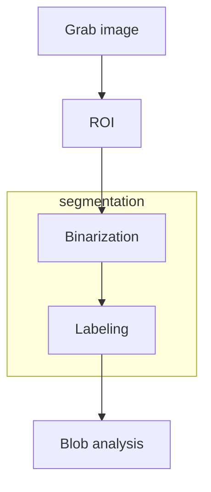

# COMPUTER VISION INDUSTRIAL WORKFLOW

Computer vision processes in industrial environment follow this schema

## BINARIZATION

It's the process of separating the foreground points from the background point in order to detect blobs in the labeling phase. This process is based on the fact that background points are usually darker then the foreground ones

## LABELING

In this step objects are detected from the binarized image

## BLOB ANALYSIS
