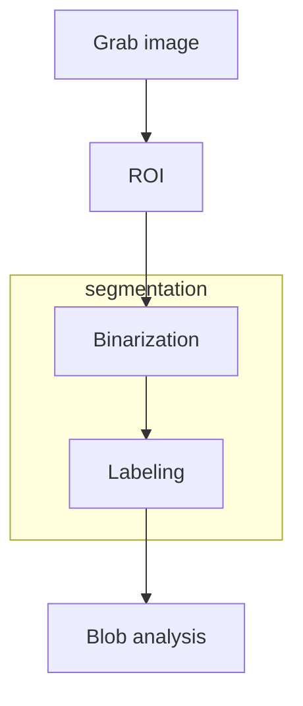

# COMPUTER VISION INDUSTRIAL WORKFLOW

Computer vision processes in industrial environment follow this schema

[PREVIOUS](pages/image_filtering/NON-LOCAL_MEAN_FILTER.md) [NEXT](pages/image_segmentation_blob_analysis/BINARIZATION.md)
