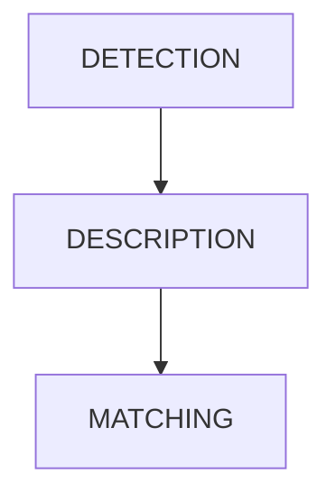

# FINDING CORRESPONDENCES

A lot of computer vision problems can be dealt with finding the correspondences between two images, The process can be described as follows

Where:

- in detection phase interesting point of an image are detected (**keypoints**)
- in description phase for each keypoint a descriptor based on the neighborhood is computed
- in the matching phase descriptors of keypoints detected from a reference image are compared against descriptors of keypoint from different images

The algorithms for the detection and description phase must have the following properties

| DETECTORS                                                                                                                  | DESCRIPTORS                                                                                                                                                                                    |
| -------------------------------------------------------------------------------------------------------------------------- | ---------------------------------------------------------------------------------------------------------------------------------------------------------------------------------------------- |
| **REPEATABILITY**  it should find the same keypoint in the image despite the transformations undergone by the images | **DISTINCTIVENESS/ROBUSTNESS TRADE OFF**  it should capture the salient information in the neighborhood of  a keypoint and also avoid noise effects from change of light intensities  |
| **INTERESTINGNESS**  It should find points with informative surroundings as to enable the matching process           | **COMPACTNESS**  description should be concise as possible in order to improve the matching process                                                                                      |
## KEYPOINTS: CHOOSE THE BEST CANDIDATE

keypoints are points that contains the most information in an image, [edges](EDGES.md) are bad candidates as **along the perpendicular direction they are pretty similar and cannot be distinguished**, points that show **high variance in all directions** are best suited for the purpose such as corners

[PREVIOUS](pages/image_segmentation_blob_analysis/BLOB_ANALYSIS.md) [NEXT](pages/local_features/EDGES.md)
