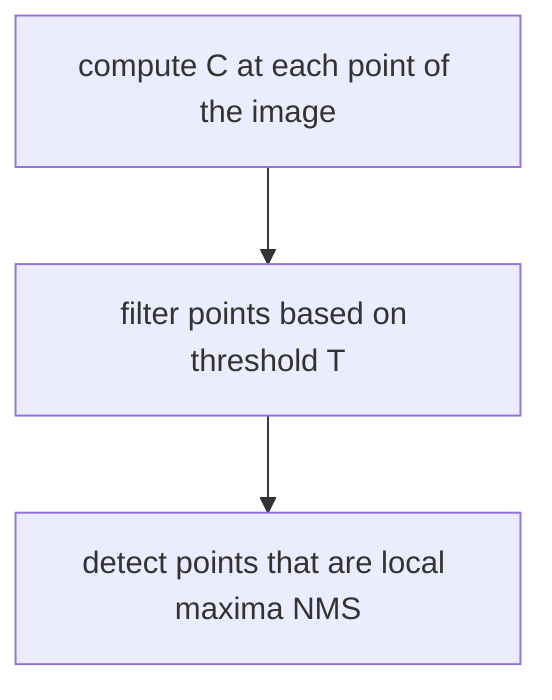

# HARRIS CORNER DETECTOR

This detector relies on a continuous reformulation of the [Moravec](MORAVEC_CORNER_DETECTOR.md) neighbor differences.
A generic infinitesimal shift from the point location can be described as

$$
E(\Delta x, \Delta y) = \sum_{x,y} {w(x,y)(I(x + \Delta x, y + \Delta y) - I(x,y))^2}
$$

With $w(x,y)$ as a weight function (*gaussian function*)

Due to the fact that it's a continuous formulation intensity function can be approximated with it's Taylor polynomial form

$$
I(x + \Delta x, y + \Delta y) - I(x,y) \simeq \frac{\delta I(x,y)}{\delta x}\Delta x + \frac{\delta I(x,y)}{\delta y} \Delta y = I_x(x,y)\Delta x + I_y(x,y)\Delta y
$$

So the edge function can be described as

$$
E(\Delta x, \Delta y)=
\begin{bmatrix}
\Delta x & \Delta y
\end{bmatrix}
\begin{bmatrix}
\sum_{x,y} w(x,y)I_x(x,y)^2 & \sum_{x,y} w(x,y)I_x(x,y)I_y(x,y) \\
\sum_{x,y} w(x,y)I_x(x,y)I_y(x,y)  & \sum_{x,y} w(x,y)I_y(x,y)^2 \\
\end{bmatrix}
\begin{bmatrix}
\Delta x \\
\Delta y
\end{bmatrix} =
$$
$$
\begin{bmatrix}
\Delta x \\
\Delta y
\end{bmatrix}M
\begin{bmatrix}
\Delta x & \Delta y
\end{bmatrix}
$$

Where the $M$ matrix encode the characteristics of the structure around the pixel, also $M$ is real and symmetric so the correspondent diagonal matrix can always be computed from the eigenvectors

$$
M = R
\begin{bmatrix}
\lambda_1 & 0 \\
 0 &\lambda_2 \\
\end{bmatrix} R^T
$$

the coefficients $\lambda_1,\lambda_2$ can be used to distinguish corners

But Computation of the eigenvector is expensive so a better approximation can be deployed

$$
C = \det(M) - ktr(M)^2 = \lambda_1\lambda_2 -k(\lambda_1 + \lambda_2)^2
$$

And with this corner can be detected as

So in conclusion the corner detection algorithm can be described as follows

In order to weights better the points in the neighborhood the weight function $w(x,y)$ used is a Gaussian function

[PREVIOUS](pages/local_features/MORAVEC_CORNER_DETECTOR.md) [NEXT](pages/local_features/SHI_TOMASI_CORNER_DETECTOR.md)
