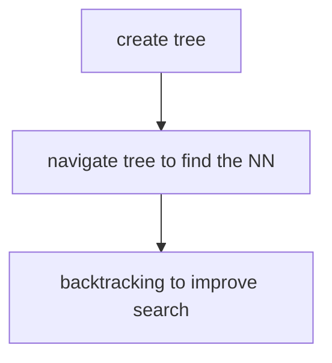
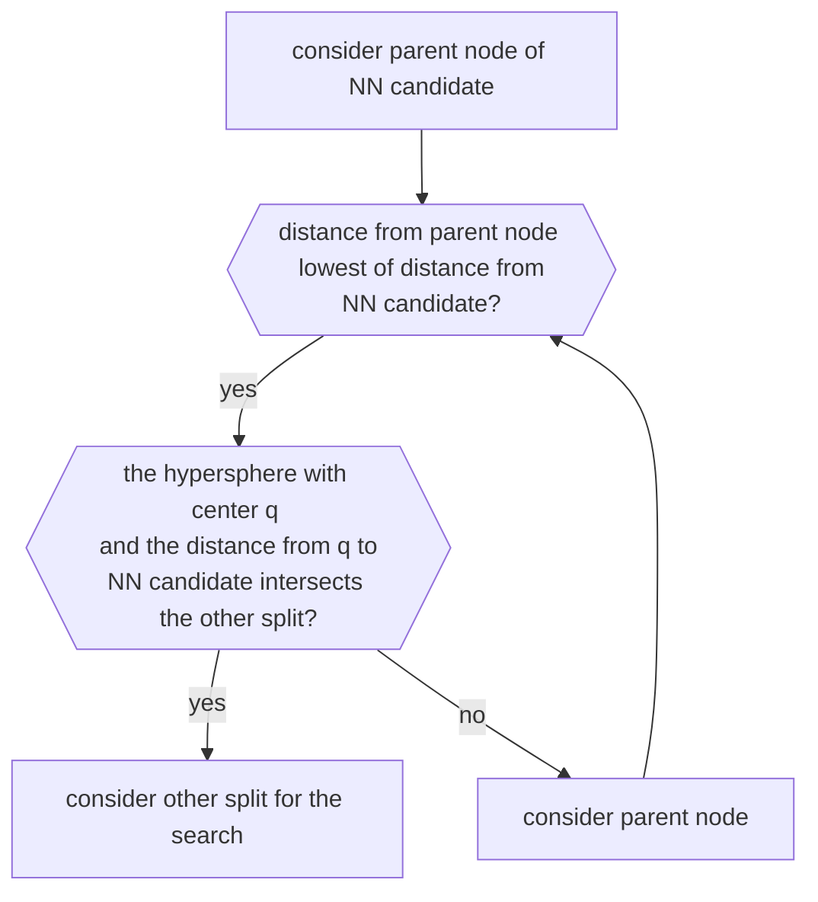

# MATCHING PROCESS

In this phase keypoint descriptor are compared in order to find correspondences, this is the **find the nearest neighbor** problem

*Given a set $S$ of points $p_i$ in a metric space $M$ and a query point $q \in M$, find the $p_i$ closest to $q$*

So in this iteration of the problem the keypoints  computed on a target image $T$ are the query point and the $S$ set of point is given by the keypoint learned from a set of training images, the metric space $M$ is the space of the [sift descriptor](SIFT_DESCRIPTOR.md) with a distance metric (usually euclidean distance)

Is not guaranteed that the $NN$ is found due to occlusion of the image or exposure changes so a criteria for detecting correct correspondences must be set:

$$
 d_{NN} \leq T \space (simple \space trashold)
$$
$$
 \frac{d_{NN}}{d_{2-NN}} \leq T \space (ratio \space of \space distances)
$$

## SEARCHING MECHANISM

Searching for the $NN$ exhaustively is expensive in terms of computation as it goes up with the size of $S$

In order to speed up the matching process the **k-d tree indexing technique** is used

### K-D TREE

Is the generalized form of the binary search algorithm at the case of $k$ dimension,

The tree is created by splitting $S$ in the dimension that shows the highest variance, using the median value

#### BACKTRACKING

Backtracking is computed from the current $NN$ candidate

The algorithm goes up to the root of the tree and finds the best $NN$

#### BACKTRACKING AND EFFICIENCY

backtracking becomes computationally expensive as the dimension of the space goes up (*so in a sift descriptor space is highly inefficient as dimension is $R^{128}$*)

### BEST BIN FIRST (BFF)

Variation of the k-d tree algorithm where traversed node are inserted in a priority queue that is used in the backtracking phase to chose the node to traverse first, the queue is updated in the backtracking phase that ends at the $E_{max}$ node

[PREVIOUS](pages/local_features/SIFT_DESCRIPTOR.md) [NEXT](pages/object_detection/INSTANCE_LEVEL_OBJECT_DETECTION.md)
