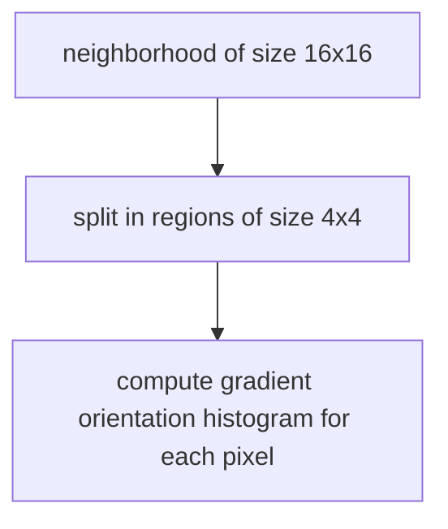

# SIFT DESCRIPTOR

This descriptor is based on the gradient direction contribution of a neighborhood of the keypoint, SIFT descriptor is computed as follows

The descriptor is given by all of the histogram of the regions so the dimension space of a SIFT descriptor is $R^{128}$

The gradient are rotated according to the canonical orientation of the gradient and each pixel is weighted by a Gaussian centered at the keypoint