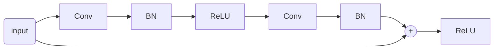
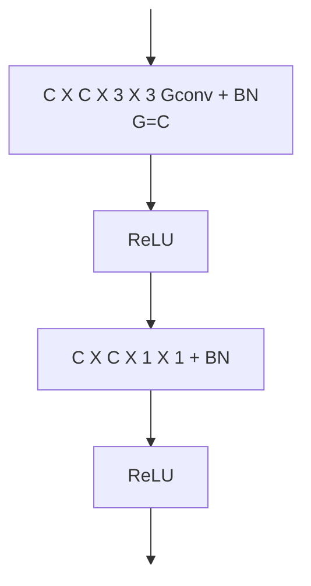

# CONVOLUTIONAL NEURAL NETWORKS (CNN)

## LIMITS OF FULLY CONNECTED LAYERS

Let's assume that the feature detection layer need to compute some kind of local features (e.g. edges or keypoints) so the dimension of the $W$ array becomes:

$$
size(W_l)= (3\times M \times N) \times (M \times N)
$$

so the network's layer dimensions increase exponentially with the image dimensions and becomes computationally impossible

## CONVOLUTION TO THE RESCUE

Similarly to what is done in [classical computer vision](LTE_OPERATORS.md), where convolution is used to detect features in deep learning convolution can be used in layers to detect features with filters that are learned [minimizing a loss function](CREATING_A_CLASSIFIER.md#MINIMIZING_THE_LOSS_FUNCTION)

## CONVOLUTIONAL LAYERS

So to achieve this in a convolutional layer input and output are not flatten and each output is connected only to a local set of the input that shares the weights thus reducing the weights array dimension of the layer

$$
y(i,j) = w_1x(i-1,j-1) +w_2x(i-1,j) +w_3x(i-1,j+1)+
$$
$$
w_4x(i,j-1) +w_5x(i,j) +w_6x(i,j+1)+
$$
$$
w_7x(i+1,j-1) +w_8x(i+1,j) +w_9x(i+1,j+1) \Rightarrow
$$
$$
y(i,j) = \sum_{m=-1}^{m=1}\sum_{l=-1}^{l=1} {w(m,l)x(i+m,j+l)}
$$

### COLOR IMAGE AS INPUTS

color images are represented as 3 channels input so convolution kernel must be 3-dimensional tensors

$$
[K\times I](i,j) = \sum_{n=1}^{3}\sum_{m}\sum_{l}K_n(m,l)I_n(i+m,j+l)+ b
$$

### OUTPUT ACTIVATION

By sliding the kernel over the image, input channel are translated in a single channel output i.e. the output activation of the convolutional layer, they are also called feature maps because layers tend to specialize in detecting specific features/patterns

### MULTIPLE CHANNEL OUTPUT ACTIVATION

It can be useful to retrieve multiple channel output for detecting multiple features (e.g. horizontal and vertical edges)

$$
[K^2\times I](i,j) = \sum_{n=1}^{3}\sum_{m}\sum_{l}K^2_n(m,l)I_n(i+m,j+l)+ b^2
$$

### GENERAL STRUCTURE

This approach can be generalized, obtaining the **general structure of a convolutional layer**:

$$
[K^k\times I](i,j) = \sum_{n=1}^{C_{in}}\sum_{m}\sum_{l}K^k_n(m,l)I_n(i+m,j+l)+ b^k\space with \space k=1..C_{out}
$$

### CHAINING CONVOLUTIONAL LAYERS

Convolutional layers are a form of linear transformation (they can be expressed by matrix) so in order to take advantage of network depth there is the need to chain them with some form of non-linearity (e.g. [relu](DEEP_LEARNING_AND_NEURAL_NETWORKS.md#ACTIVATION%20FUNCTION))

The main advantage of chaining is that with each level of depth the number of input pixels that the layer takes into account (e.g. the **receptive field**) gets larger and larger enabling the network to detect larger patterns

### STRIDED CONVOLUTION

Convolution can be computed every $S$ (stride) positions in both directions

## POOLING LAYERS

Pooling layers are layers with handcrafted functions that aggregates the input neighboring values in order to downsample the output

The pooling layer introduces some more hyperparameters such as dimensions of the kernel and stride

## CNN FINAL STRUCTURE

Example of cnn's can be [LENET](LENET.md) and [ALEXNET](ALEXNET.md)
## NUMBER OF LEARNABLE PARAMETERS

For a single convolutional layer the number of learnable parameter depends on kernel dimensions and input and output activation dimensions so the size of the $W$ array can be obtained as:

$$
C_{out} \times (C_{in} \times H_k \times W_k +1)
$$

## THE PROBLEM WITH INCREASING DEPTH

Intuitively increasing depth should take better results at the price of computation cost but as shown by [VGG](VGG.md) in real testing this is not the case

### RESIDUAL LEARNING AS A SOLUTION

The idea is to add skip connection in order to fast forward the input to the deep nested layers

So the output is given by:

$$
H(x) = F(x)+x
$$

An example of this can be found in [RESNET](RESNET.md)

### GLOBAL AVERAGE POOLING

In order to reduce the number of parameter at the begin of the [FC layers](DEEP_LEARNING_AND_NEURAL_NETWORKS.md#FULLY%20CONNECTED%20LAYERS) the output can be processed by average pooling

### GROUPED CONVOLUTIONS

In order to improve the computational costs kernels are split into $G$ groups and each group process $\frac{C_{in}}{G}$ input channels, with this required flops and number of parameters are scaled by a $G$ factor

## DEPTHWISE SEPARABLE CONVOLUTIONS

In order to improve the computational cost of convolution depthwise variant splits the spatial analysis and the feature combination and perform them sequentially.

The first convolution step is realized as a [GROUPED CONVOLUTIONS](#GROUPED%20CONVOLUTIONS)
## TRANSFER LEARNING

To prevent overfitting, training of a deep neural network requires too big datasets that in a lot of deployment scenarios are expensive.

So in order to train big CNN a 2 steps approach is adopted:

- **pre-train** the deep network with a large, general purpose dataset
- **fine-tune** specific parts of the network with the smaller specific one dataset

[PREVIOUS](pages/machine_learning_cv/DEEP_LEARNING_AND_NEURAL_NETWORKS.md) [NEXT](pages/machine_learning_cv/LENET.md)
