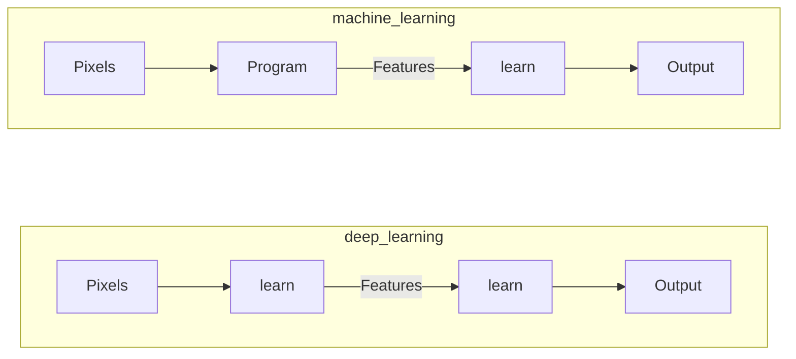
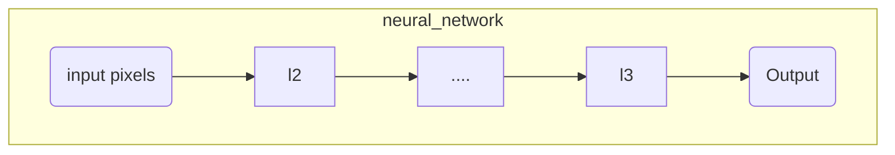

## MACHINE LEARNING VS DEEP LEARNING

Instead of writing a program that outputs a features space for the classifier, it's better to learn also the feature creation algorithm, that is what deep learning is about

The learning phase needs to introduce non-linear computation in the chain in order to produce usefull features for the classifier.

So the feature learn layer can be realized as a set of non linear functions called activation functions that take as input a linear combination of the input of the layer

each layer contains $D$ nodes ($D$ is an hyperparameter)
Where the function of the $l_i$ layer can be defined as:

$$
L_i= \phi(Wx+b)
$$
where the $\phi()$ is the activation function and $W$ is a weight vector of size $D \times imageSize$

### ACTIVATION FUNCTION

non linear functions used in the layers to perform the features computation examples are:

with equations:
$$
\begin{align}
\phi(a) = \frac{1}{1 + exp(-a)}&& \phi(a)=\max(a,0)\\
\end{align}
$$
## FULLY CONNECTED LAYERS

Networks where the input of the $L_i$ layer is the output of all the nodes of the $L_{i-1}$ layer

the output of the $y_i$ node can be described as :

$$
y_i = \phi(\sum_{j=1}^{D}{W_{ij}x_j +b_i})
$$

[PREVIOUS](pages/machine_learning_cv/CREATING_A_CLASSIFIER.md) [NEXT](pages/machine_learning_cv/CONVOLUTIONAL_NEURAL_NETWORKS.md)
