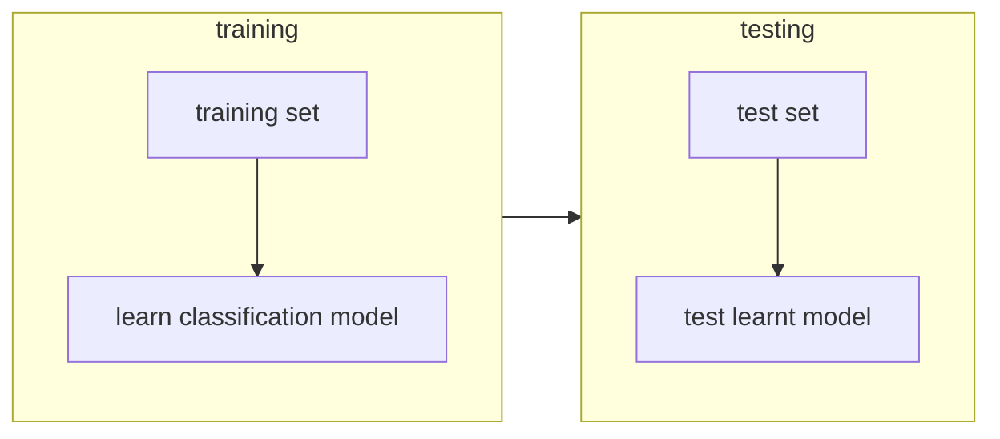

# MACHINE LEARNING IN COMPUTER VISION

There are problems in computer vision scenarios that can not be dealt with classical computer vision approach for example **image classification**:

In order to address this situation machine learning techniques are deployed.

## THE PROBLEM OF IMAGE CLASSIFICATION

The problem of image classification relies on a classification algorithm that can deal with the huge variety of the input data, it's impossible to handcraft such an algorithm so in order to address this problem machine learning is involved

## MACHINE LEARNING FOR IMAGE CLASSIFICATION

Machine learning techniques deployed relies on a training phase in which the model is learned by a training set of images with provided labels and a test phase where model performance are tested

The training and testing datasets can be defined as follows

$$
D^{train} = \{(x^i,y^i)|i=1 ... N\}
$$
$$
D^{test} = \{(x^i,y^i)|i=1 ... M\}
$$

Where $x^i$ are the given input feature (*images*) and $y^i$ are the true labels for the corresponding input feature

## MODELING THE "LEARNING" CONCEPT

In machine learning the training phase can be seen as an optimization problem that aims to optimize an objective function which measures how good the prediction on the training set $D^{train}$ are

$$
\theta^{\ast} =argmin_{\theta \in \Theta}(L(\theta,D^{train}))
$$

Where $L(\theta,D^{train})$ is called **Loss function** and measures how bad the prediction on the training set are so **the lower the better** is common practice to implement the Loss function as the average of the single images

$$
L(\theta,D^{train}) = \frac{1}{N}\sum_{i=0}^{N}{L(\theta,(x^i,y^i))}
$$
## UNDERFITTING AND OVERFITTING PROBLEM

When varying model complexity training and test error follow this curve

So with complex models the training error increases, this is called overfitting

### REGULARIZATION

Regularization aims to reduce the test error without modifying the training error

The basic idea under this concept is that models with lower parameter tend to overfit less.

In order to implement such solution a regularize parameter is introduced to express a preference for smaller parameter values

$$
L(\theta,D^{train}) + \lambda L^{reg}(\theta)
$$

where $\lambda$ is an hyperparameter that determines the contribution of the regulator, popular choices of the regulator can be:

$$
L^{reg} = L_1(\theta) = \vert \theta \vert = \sum_{i} \vert \theta_i \vert
$$
$$
L^{reg} = L_2(\theta) = \Vert \theta \Vert^2 = \sum_{i} \theta_i^2
$$

## DATA AUGMENTATION

In order to artificially increase the size of datasets operation on the input image are performed without altering the label such as image rotation,crop,cutout

[PREVIOUS](pages/object_detection/OBJECT_DETECTION_PIPELINE.md) [NEXT](pages/machine_learning_cv/CREATING_A_CLASSIFIER.md)
