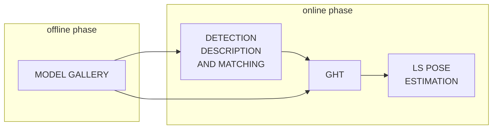

# OBJECT DETECTION PIPELINE

```mermaid
flowchart LR

subgraph online phase
direction LR
B[DETECTION\n DESCRIPTION\n AND MATCHING]
C[GHT]
D[LS POSE\n ESTIMATION]
B --> C --> D
end

subgraph offline phase
direction RL
A[MODEL GALLERY]
A --> B & C
end
```

[PREVIOUS](pages/object_detection/GENERALIZED_HUGH_TRANSFORM.md) [NEXT](pages/machine_learning_cv/MACHINE_LEARNING_IN_COMPUTER_VISION.md)
